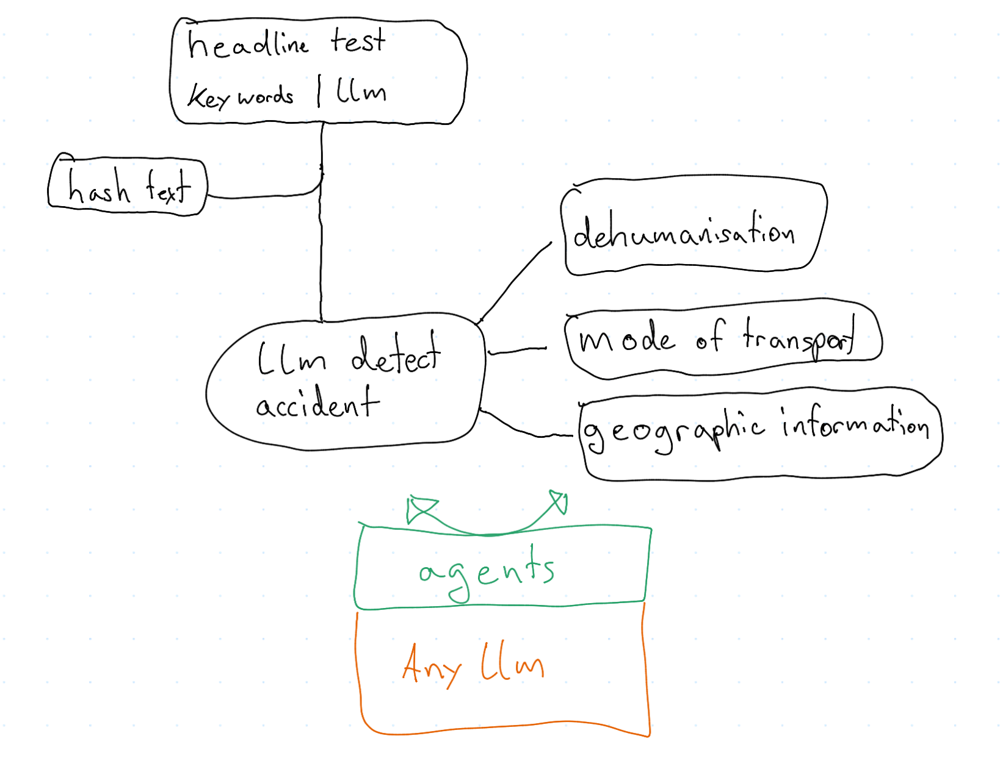

### Dehumanising detectors

## TODO
 - Upload articles without location, see section roaddanger.org for details
 - Implement telegram bot (https://python-telegram-bot.org/)
 - Create mathematical model that automatically calculates human eval. 

## Data aggrigation
We use multiple data sources: roaddanger.org db, lexisnexus, newsapi and dzen.ru
Have a look at the file data_summary.ipynb to see what data we have for now.

# Roaddanger.org
The information form roaddanger that we need is incomplete, I used the coordinates of the accident to identify the country. From roaddangers dataset there are 1419 articles uploaded, there were 14550 articles that still arent identified yet. Those articles are referenced under src/uncategorised_articles.txt. 
The rest has still to be identified

The dehumanisation index is also not in the db yet because there are multiple standarts in the db provided by jan

## Schematics

# Suprabase
Suprabase is a easy to use real-time database. 
The advantage of using a real-time database is that the same data can be administred from different devices at the same time. This way we can upload new articles make data analysis at the same time without data collision or doing the same computation twice. 

# Telegram bot
Becaues we need to evaluate our model(s) performance we need volunteers that evaluate texts for us. 
A telegram bot is very well suited for that task because its very easy to use, we can reach a lot of people and even send push notifications to people.

Look into:
- Article python package
- Riveter package, looks who object and subject is and action